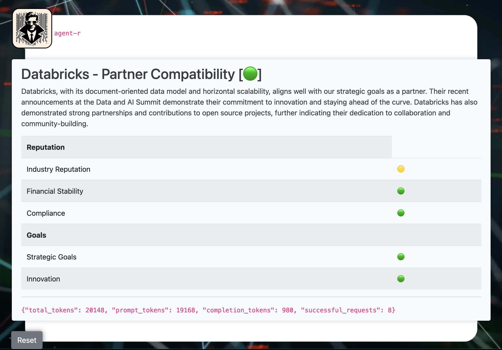

# AI-Powered Research


## **Bias and the Illusion of Intelligence: A Closer Look at AI**

As AI systems grow more sophisticated, their perceived intelligence often hinges on their ability to perform tasks effectively. Consider, for example, an AI agent tasked with selecting the most appropriate tool for a given job. If the training data used to develop the agent is biased towards certain tools or tool categories, the agent may consistently choose those options, even if they are suboptimal for specific tasks. This bias-induced limitation can create the illusion of intelligence, as the agent may appear to be making informed decisions when, in reality, it is simply reproducing the biases present in its training data.

Consider, for example, an AI agent designed to recommend job candidates. If the training data used to develop this agent is predominantly composed of resumes from individuals from a specific demographic, the agent may inadvertently perpetuate existing biases by consistently recommending candidates from that same demographic, even if they are not the most qualified for the position. This bias-induced limitation can create the illusion of intelligence, as the agent may appear to be making objective and fair recommendations when, in reality, it is simply reproducing the biases present in its training data.

## AI Agent - Evaluating Company Potential



**Key Features**

* **Automated Company Search:** Effortlessly find company information across the web.
* **YouTube Transcript Summarization:** Extract key points from relevant YouTube videos, saving you valuable time.
* **HTML Report Generation:** Receive a visually appealing report summarizing the company's suitability for partnership.

**Benefits:**

* **Effortless Research:** Automate tedious tasks and focus on strategic planning.
* **Data-Driven Insights:** Gain valuable insights from AI-powered analysis.
* **Increased Efficiency:** Streamline your research process and improve decision-making.
* **Scalability:** Handle complex research requests with ease.

**Live Demo**

1. **Run the App:** Open a terminal and execute `python app.py`.
2. **Visit the Demo Page:** Navigate to `http://localhost:8080/demo` in your web browser.
3. **Enter Company Name:** Provide the name of the company you'd like to research.
4. **Start Research:** Click the "Start Research" button.
5. **Unveil Insights:** The application will gather information and present a comprehensive HTML report outlining the company's potential for partnership.

## The Unpredictable Mind of AI Agents

One of the most significant challenges in LLM-powered agents is the unpredictability of their planning processes. While these agents can generate impressive outputs, their internal reasoning is often opaque, making it difficult to understand how they arrived at their conclusions. This lack of transparency makes it challenging to understand and control the agent's behavior.

### The Black Box of AI Reasoning
* **Complex Internal Mechanisms:** LLMs are incredibly complex systems with billions of parameters. Their reasoning process involves intricate interactions between these parameters, making it difficult to trace the exact steps that led to a given output.
* **Data-Driven Nature:** LLMs are trained on massive datasets, and their responses are influenced by the patterns and correlations they have learned from this data. This can make it challenging to predict how they will respond to new or unusual prompts.
* **Randomness:** LLMs often incorporate elements of randomness into their decision-making processes. This can introduce variability into their outputs, even for the same prompt.

### The Implications of Uncontrolled Behavior
This unpredictability can have significant implications for the use of LLM-powered automations. It can make it difficult to:
* **Debug Errors:** When an agent produces an incorrect or unexpected result, it can be challenging to determine the root cause.
* **Ensure Reliability:** It can be difficult to guarantee that an agent will consistently produce accurate and reliable outputs.
* **Understand Limitations:** It can be challenging to identify the limitations of an agent and determine when it is not suitable for a particular task.

### Addressing the Challenge
While it may not be possible to completely eliminate the unpredictability of LLM-powered agents, there are steps that can be taken to mitigate its effects. These include:
* **Rigorous Testing:** Thoroughly testing agents in a variety of scenarios can help to identify potential issues and improve their reliability.
* **Human Oversight:** Incorporating human oversight can help to ensure that agents are used appropriately and that their outputs are reviewed for accuracy.
* **Transparency Efforts:** Researchers are actively working on developing techniques to make the reasoning processes of LLMs more transparent.

## Beyond the Hype: Understanding the Limitations of LLMs

**The Challenge of Control**

One of the most significant hurdles in harnessing the power of LLMs is their propensity to generate unexpected or even harmful outputs. This can occur due to various factors, including:

* **Bias in Training Data:** If the data used to train an LLM is biased, the model will inevitably reflect those biases in its responses.
* **Prompt Engineering:** The specific wording of a prompt can significantly influence the output, making it difficult to predict how a model will respond to certain queries.
* **Emergent Behaviors:** As LLMs become more complex, they can exhibit unexpected behaviors that are difficult to explain or control.

**LLMs as Mathematical Models**

It's essential to understand that LLMs are fundamentally mathematical models. They are designed to process and generate text based on patterns and correlations found in massive datasets. While they can produce impressive results, their "intelligence" is not the same as human intelligence.

* **Lack of Understanding:** LLMs do not truly understand the meaning of the words they generate. They simply manipulate symbols based on statistical probabilities.
* **Dependence on Training Data:** The quality and quantity of the training data are crucial factors in determining an LLM's performance. A model trained on limited or biased data will have limitations.

## Potential Problems for an LLM Filling Out a Template with Color-Coded Ratings

An LLM (Large Language Model) can encounter several challenges when filling out a template with color-coded ratings (🔴, 🟡, 🟢). These challenges arise due to the nuances of natural language understanding, knowledge representation, and task-specific requirements.

### 1. **Subjectivity and Contextual Understanding:**
* **Ambiguity in Ratings:** The terms "High," "Medium," and "Low" can be subjective and depend on the context. For example, a "High" risk for a small business might be a "Low" risk for a multinational corporation.
* **Contextual Nuances:** The LLM might struggle to understand the specific context of the template and the implications of different ratings. For instance, a "High" rating for a safety feature might have a different impact than a "High" rating for a marketing campaign.

### 2. **Knowledge Gaps and Inconsistency:**
* **Lack of Domain Expertise:** If the LLM lacks sufficient domain knowledge, it might assign incorrect ratings. For example, a model might rate the complexity of a medical procedure as "Low" if it doesn't understand the underlying medical concepts.
* **Inconsistent Ratings:** The LLM might provide inconsistent ratings for similar items or situations, leading to errors and inconsistencies in the filled-out template.

### 3. **Template Structure and Complexity:**
* **Complex Templates:** If the template is highly complex with multiple interconnected fields, the LLM might struggle to understand the relationships between different elements and assign appropriate ratings.
* **Ambiguous Instructions:** If the instructions for filling out the template are unclear or ambiguous, the LLM might misinterpret them and provide incorrect ratings.

### 4. **Data Quality and Bias:**
* **Biased Training Data:** If the LLM was trained on biased data, it might perpetuate those biases in its ratings, leading to unfair or inaccurate assessments.
* **Data Limitations:** If the LLM doesn't have access to sufficient or relevant data, it might struggle to provide accurate ratings.

## **Expanding on LLM Bias and Explainability Techniques**

### **Understanding LLM Bias**

* **Types of Bias:**
  * **Representation Bias:** When the training data doesn't represent the diversity of the real world.
  * **Association Bias:** When the model associates certain attributes with negative or positive outcomes.
  * **Confirmation Bias:** When the model reinforces existing beliefs or stereotypes.

### **Explainability Techniques for LLMs**

* **Attention Visualization:** Visualize the attention weights assigned to different parts of the input, revealing which parts of the text are most influential in the model's output.
* **Saliency Maps:** Highlight the most important regions of an input image or text that contribute to the model's prediction.
* **Counterfactual Explanations:** Generate alternative inputs that would have led to different outputs, helping to understand the model's decision boundaries.
* **SHAP (SHapley Additive exPlanations):** Attribute the contribution of each feature to the model's prediction.

**The Proprietary Challenge: Limitations in Directly Applying Explainability Techniques to OpenAI Models**

While the explainability techniques discussed earlier provide valuable insights into LLM decision-making, their direct application to OpenAI models can be challenging due to proprietary nature of these models. 

Here are some key limitations:

* **Black Box Architecture:** OpenAI models are often designed as black boxes, meaning the internal workings and parameters are not publicly accessible. This makes it difficult to directly apply techniques that require detailed knowledge of the model's architecture, such as attention visualization or saliency maps.
* **Limited Access to Training Data:** The training data used to develop OpenAI models is proprietary, making it impossible to analyze the data directly for biases or other issues. This limits the effectiveness of techniques that rely on understanding the composition of the training data.
* **API Constraints:** When using OpenAI models through an API, access to the underlying model may be restricted. This can prevent the application of techniques that require direct interaction with the model's internals.

**Workarounds:**

* **Proxy Models:** Creating proxy models that mimic the behavior of large language models can provide insights into their decision-making processes. While not perfect, these proxy models can be used to apply explainability techniques.
* **Adversarial Attacks:** Adversarial attacks can be used to probe the model's vulnerabilities and identify potential biases. By understanding how the model reacts to carefully crafted inputs, we can gain insights into its decision-making process.

While the challenges of understanding and controlling LLM bias are significant, it's precisely this element of unpredictability that makes these models so fascinating. The enigmatic nature of their decision-making processes, coupled with their immense potential, invites us to explore the boundaries of AI and to strive for a future where LLMs are both powerful and responsible tools.

## Getting Started
This is a Flask application that uses Azure OpenAI to perform research on a company and generate a report on its potential for partnership opportunities. The application uses the DuckDuckGo search engine to gather information about the company and then uses Azure OpenAI to analyze the data and generate a report. The report includes information on the company's reputation, financial stability, compliance, strategic goals, and innovation.

Let's begin!

1. Clone the repository.
2. Install the required packages using pip


## Configuration

The application requires the following environment variables:

- `OPENAI_AZURE_ENDPOINT`: The endpoint for the Azure OpenAI API.
- `OPENAI_AZURE_API_KEY`: The API key for the Azure OpenAI API.

## Search Tool

```python
class WebSearch(BaseTool):
    name: str = "Web Search"  # Add type annotation for 'name'
    description: str = "Searches the web for relevant content."
    def _run(self, query: str) -> str:
        query = query + " 2024 company video site:youtube.com AND inlang:en AND inurl:youtube AND inurl:v="
        results = DDGS().text(str(query),region="us-en", max_results=1)
        VIDEO_IDS = []
        video_transcript_text = ""
        for result in results:
            VIDEO_IDS.append(result["href"])
            video_transcript_text = get_transcript(extract_youtube_id_from_href(result["href"]))
        print(VIDEO_IDS)
        messages = [
            (
                "system",
                "You are a helpful assistant that summarizes video transcripts into detailed markdown with key facts in list format.",
            ),
            ("human", "What are some key facts about the following content:\n\n" + video_transcript_text),
            ("human", f"""
             [response format]
                - MUST BE VALID MARKDOWN LIST FORMAT
                - MUST BE VALID MARKDOWN STRING
             [end response format]

             FOCUS ON {query}
             """),
        ]
        ai_msg = default_llm.invoke(messages)
        return f"Search results for: {query}: \n\n\"{ai_msg.content.strip()}\":"
    
search_tool = WebSearch()
```

## Crew Code

```python
class CustomCrew:
    def __init__(self, company_name):
        self.company_name = company_name

    def run(self):
       # Define agent with a more specific role and backstory
        custom_agent_1 = Agent(
            role="Partner Compatibility Analyst",
            backstory="I am an expert in assessing the suitability of potential business partners.",
            goal=f"Research the {self.company_name}, its products, and its latest news to determine compatibility as PARTNER.",
            tools=[search_tool],
            allow_delegation=False,
            verbose=True,
            llm=default_llm,
            memory=True, # Enable memory
            cache=True, # Enable cache
        )

        # Generate a more relevant search query using keyword extraction or semantic search

        custom_task_1 = Task(
            description=dedent(
                "\n\n[additional context]"+target_context+"\n\n[end additional context]"+"\n\n"+
                f"""          
[task]
    Use the research on your web search to create a concise HTML report with structured data and a clear recommendation.
    Search the web researching {self.company_name}, and generate a concise HTML response. 
    Do your best to generate a response with your web research without overusing your tools [IMPORTANT]
    Your recommendation from be from the perspective of {self.company_name}.
[IMPORTANT]
- KEEP YOUR RESPONSE TO 600 CHARACTERS! IMPORTANT!
- ALWAYS TRY TO ANSWER THE QUESTION IN A CLEAR AND CONCISE MANNER.
- BE CONSERVATIVE WITH YOUR TOOL USE. DO NOT OVERUSE IT. 
- CHOOSE FROM THESE QUERIES TO USE FOR YOUR SEARCH TOOL:
    - {self.company_name} + company recent news
    - {self.company_name} + company partnership partner
- IMPORTANT! AFTER A FEW SEARCHES, ATTEMPT TO RESPOND TO THE BEST OF YOUR ABILITY. DO NOT OVERUSE YOUR TOOLS!
    
"""
            ),
            agent=custom_agent_1,
            expected_output="""
concise HTML report with structured data and a clear recommendation. 
The HTML string will be injected into a `<div>`       

IMPORTANT! FOLLOW THE TEMPLATE STRUCTURE BELOW:
[template]
<h2>{self.company_name} - {target} [🔴 | 🟡 | 🟢]</h2>
<p>...</p>
<table>
<tbody>
    <tr>
    <th>Reputation</th>
    </tr>
    <tr>
    <td>Industry Reputation</td>
    <td>[🔴 | 🟡 | 🟢] ...</td>
    </tr>
    <tr>
    <td>Financial Stability</td>
    <td>[🔴 | 🟡 | 🟢] ...</td>
    </tr>
    <tr>
    <td>Compliance</td>
    <td>[🔴 | 🟡 | 🟢] ...</td>
    </tr>
    <tr>
    <th colspan="2">Goals</th>
    </tr>
    <tr>
    <td>Strategic Goals</td>
    <td>[🔴 | 🟡 | 🟢] ...</td>
    </tr>
    <tr>
    <td>Innovation</td>
    <td>[🔴 | 🟡 | 🟢] ...</td>
    </tr>
</tbody>
</table>
[end template]

[response criteria]
- HTML Structure must match the template! IMPORTANT!
- MUST BE RAW HTML STRING! IMPORTANT!
- USE EMOJIS! For High, Medium, and Low, use emojis not words.
- High = 🔴, Medium = 🟡, Low = 🟢. DO NOT USE WORDS!
- YOUR HTML MUST USE BOOTSTRAP CSS.
- MAX RESPONSE LENGTH = 600 CHARACTERS.
- DO NOT INCLUDE <html> or <body> or things like that, just the raw HTML string that can be injected into a <div>
[end response criteria]

[example response for company `ORACLE`]
<h2>ORACLE - {target} [🔴]</h2>
<p>Oracle is a global provider of database technology and enterprise resource planning software. The company has demonstrated financial stability, solid revenue streams, and profitability. However, it's market leadership in the cloud and license segment does not align with our strategic goals and objectives.</p>
<table class="table table-striped">
<tbody>
    <tr>
    <th>Reputation</th>
    </tr>
    <tr>
    <td>Industry Reputation</td>
    <td>🟡</td>
    </tr>
    <tr>
    <td>Financial Stability</td>
    <td>🟢</td>
    </tr>
    <tr>
    <td>Compliance</td>
    <td>🟡</td>
    </tr>
    <tr>
    <th colspan="2">Goals</th>
    </tr>
    <tr>
    <td>Strategic Goals</td>
    <td>🔴</td>
    </tr>
    <tr>
    <td>Innovation</td>
    <td>🟡</td>
    </tr>
</tbody>
</table>
[end example response]
            """,
        )


        # Define crew with updated agents and tasks
        crew = Crew(
            agents=[custom_agent_1],
            tasks=[custom_task_1],
            verbose=True,
        )

        # Run the crew and format output for HTML
        result = crew.kickoff()
```

## Usage

1. Run the Flask application:

```bash
python app.py
```

2. Open a web browser and navigate to `http://localhost:8080/demo`.
3. Enter the name of the company you want to research and click "Start Research".
4. The application will perform the research and display the report in the browser.

